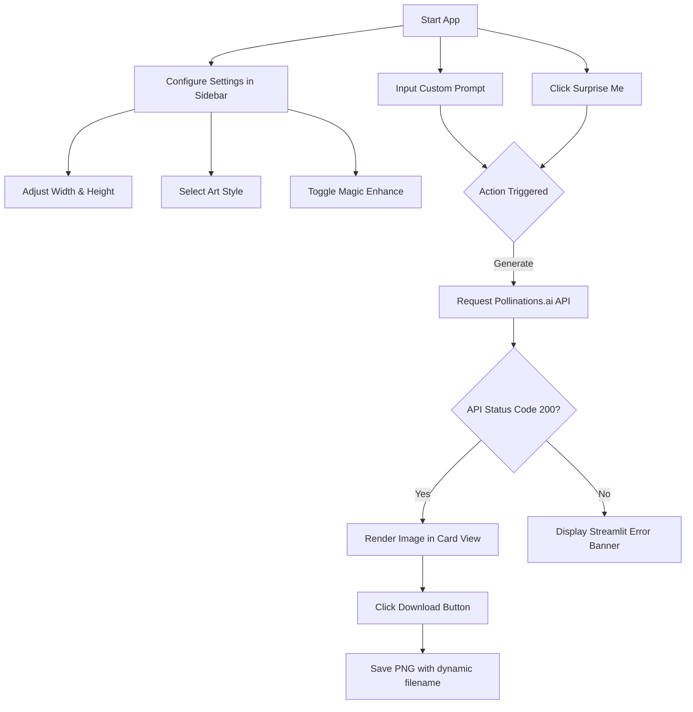

# AI Image Studio Pro 🎨

AI Image Studio Pro is a premium, feature-rich web application built with Streamlit and integrated with the free Pollinations.ai API to generate high-fidelity digital art on the fly. It features custom glassmorphic styling, settings configuration, persistent page state management, and an automated prompt enhancement engine.

---

## 🚀 Key Features

* **Interactive Control Center**: Configure image parameters (width, height, art style) dynamically from a sleek settings sidebar.
* **✨ Magic Enhance**: Automatically appends professional prompt keywords (e.g. `masterpiece`, `8k resolution`, `highly detailed`, `unreal engine 5 render`) to boost quality.
* **🎲 Surprise Me!**: Instantly generates an image using one of five creative pre-configured prompts.
* **Persistent Caching**: Leverages Streamlit state caching to prevent the common issue where generated images disappear when sliders or selectboxes are modified.
* **Dynamic Downloader**: Automatically saves output images in PNG format with a file name matching the selected art style (e.g. `cyberpunk_image.png`).
* **Environment-Driven Configuration**: Easily configure endpoints, timeout settings, and log outputs via a local `.env` file.

---

## 🛠️ Tech Stack

* **Front-end UI**: [Streamlit](https://streamlit.io/) (enhanced with custom glassmorphism CSS overlays)
* **Image Processing**: [Pillow](https://python-pillow.org/) (for robust image format buffering)
* **HTTP Client**: [Requests](https://requests.readthedocs.io/en/latest/) (for API fetching with custom timeouts)
* **Configuration Loader**: [python-dotenv](https://github.com/theofidry/django-dotenv-files) (for environment variable injection)
* **Testing Engine**: [Pytest](https://docs.pytest.org/) (for unit testing and verification)

---

## 🔌 API Endpoints

The application interacts with the Pollinations.ai service using the following base template:

```http
GET {POLLINATIONS_API_URL}/prompt/{encoded_full_prompt}?width={w}&height={h}
```

* **Path Parameters**:
  * `encoded_full_prompt`: URL-encoded string containing the base prompt, art style, and (optional) Magic Enhance boost phrases.
* **Query Parameters**:
  * `width`: Target width in pixels (range: `256` to `1024`, step: `64`).
  * `height`: Target height in pixels (range: `256` to `1024`, step: `64`).

---

## ⚙️ Configuration Setup

Settings are managed using environment variables. To configure:

1. Copy the example environment file:
   ```bash
   cp .env.example .env
   ```
2. Open `.env` and adjust the variables:
   ```env
   # Pollinations.ai API Settings
   POLLINATIONS_API_URL=https://image.pollinations.ai
   API_TIMEOUT_SECONDS=60

   # Application configuration
   LOG_LEVEL=INFO
   ```

---

## 🏁 Getting Started

### 1. Clone the Repository
```bash
git clone https://github.com/jayendrasai/AI_Image_Studio.git
cd AI_Image_Studio
```

### 2. Create a Virtual Environment
```bash
python3 -m venv .venv
source .venv/bin/activate
```

### 3. Install Dependencies
```bash
pip install -r requirements.txt
```

### 4. Run Unit Tests
Verify the core functions (such as URL path quoting, prompt enhancement, and error handlers) are working correctly:
```bash
python -m pytest
```

### 5. Launch the Web Application
```bash
streamlit run app.py
```
Open your browser and navigate to `http://localhost:8501`.

---

## 🗺️ User Workflow


